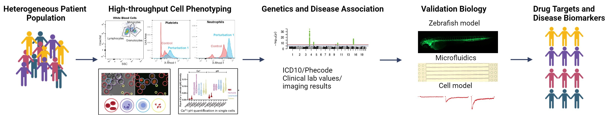

---
# Leave the homepage title empty to use the site title
title:
date: 2022-10-24
# Page type - we want a landing page (such as a homepage)
type: landing

# Your landing page sections - add as many different content blocks as you like
sections:
  # A section to display blog posts
  - block: collection
    id: section-1
    content:
      title: Research
      #subtitle: A subtitle
      text: Each second, billions of electrical events occur in our body. These rapid electrical signals can be triggered by mechanical forces, propagation from neighboring cells, or biochemical cues. They encode essential cell functions while interacting with other processes, such as cell metabolism and gene transcription. The ability to decode these electrical signals presents immense opportunities for therapeutic targeting.    Our lab's long-term goal is to understand how electrical and mechanoelectrical signaling regulate cell function in both excitable (cardiac) and non-excitable (blood and endothelial) tissues in health and diseases. We will explore how modulating these signals can alter cell behaviors and potentially lead to treatments for a range of common diseases.   To enhance the translational value of our research, we integrate human samples, genetics, and clinical data into our discovery framework. We then investigate detailed mechanisms using a combination of zebrafish, cell, and tissue-on-a-chip models, utilizing transcriptomics, imaging, and electrophysiology techniques.   **Ongoing Projects**  

      # Display content from the `content/post/` folder
      filters:
        folders:
          - research
    design:
      # Choose how many columns the section has. Valid values: '1' or '2'.
      columns: '1'
      # Choose your content listing view - here we use the `showcase` view
      view: showcase
      # For the Showcase view, do you want to flip alternate rows?
      flip_alt_rows: true
---
